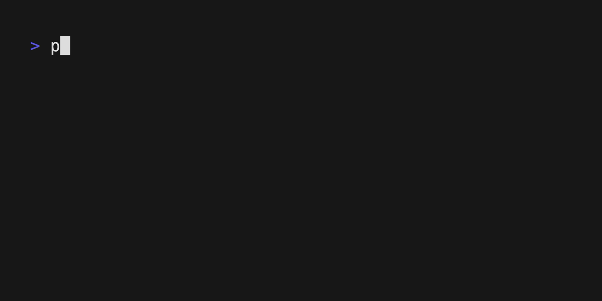

This is a quick article about why you should learn markdown.

## What is markdown

Markdown is a "mark-up" language. It allows you to write content in plain text
that can be easily converted to other formats, such as **html, pdf, docx**, and
many more. All the articles written on this website are written in markdown,
here's an image of this article written in markdown.

The reason you should learn markdown is that it allows you to focus on the
content / text of your content with simple concepts for formatting. Markdown is
used heavily in documenting software projects, which is how I got introduced to
it, however it can scale all the way up to writing research papers or even
books.

I use markdown for probably 80% of all the text documents I need to write, from
company documents, web / software documentation, and so on. It allows me to get
content out quickly without having to click around with formatting options in a
program like **Word** or **Pages**. To be clear, a lot of the reports and things
I generate for my **Home Performance Assessments** are written using **Pages**
(for now at least) because I have templates that make the documents look more
professional, however I am working on solutions to migrate those to be markdown
based.

Markdown is supported in mostly all the **Google** tools, as well as the
**Outlook** email client (which is one of my least favorite tools, BTW). It
makes it simple to create tables, lists, and many common document related tasks.

## Resources

You can learn more about the syntax used for markdown at
[markdownguide.org](https://www.markdownguide.org/basic-syntax/).

### A non-exhaustive list of where you can use Markdown and editors.

| Platform     | Description                                                     |
| ------------ | --------------------------------------------------------------- |
| Google       | Most goggle tools support markdown, docs, sheets, etc.          |
| Outlook      | Although I hate outlook email client, it does support markdown. |
| Dillinger.io | An online tool for writing / previewing markdown                |
| MarkText     | A multi-platform editor for writing markdown                    |

You can use tools such as [pandoc](https://pandoc.org/#) to convert Markdown
files to other formats.

## Conclusion

I hope that you take the time to research and see if Markdown is good fit for
your document / content creation.

Thanks for reading until the end!
