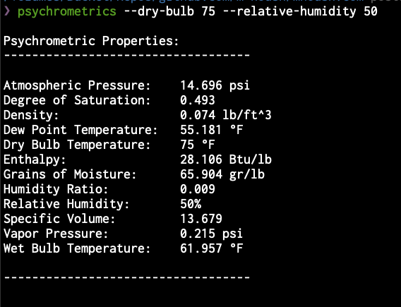
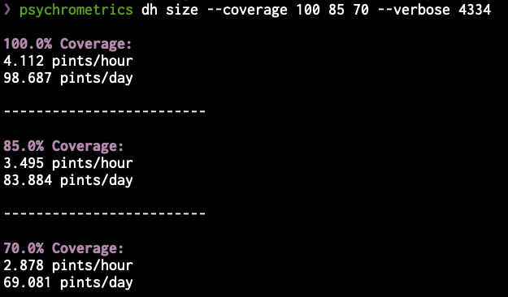
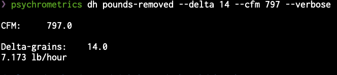
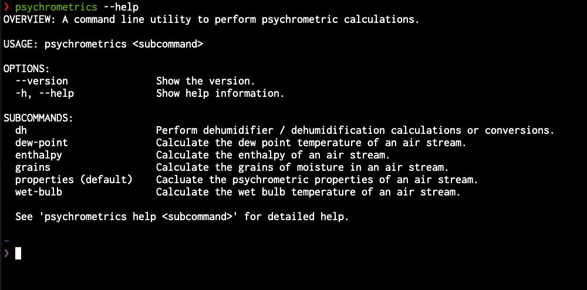

# Introducing Psychrometrics CLI

Today, I'm releasing a command line application that is built on top
of my [swift-psychrometrics](https://github.com/swift-psychrometrics/swift-psychrometrics)
package, that I open sourced over 2 years ago.

The application consists of many calculations / conversions for psychrometric properties
of an air stream.  The tool works for both imperial and metric units.  The application will
work natively on macOS, but can also be ran through a `docker` container on other platforms.

## Why

I spend a lot of time in my terminal, because I can work so much more efficiently. I discovered
many years ago that the more I can do using simple applications and keyboard over a mouse and
a web browser or native application the more I can accomplish.  I understand this is intimidating
for many who think they are _"not good with computers"._ I can assure that was me several years
ago, I would only encourage you to not be afraid and give it a shot. We are at a time in society
where it is easier than ever to get informed and learned new skills.

## Installation

For complete installation instructions, you can view the
[github](https://github.com/swift-psychrometrics/psychrometrics-cli) repository.

The following instructions are based on using macOS.

### Open your terminal application.

Personally, I use [iTerm2](https://iterm2.com/), however you can use the default `Terminal` app.
Found at `/Applications/Utilities/Terminal.app`.

## Install Homebrew

We use [Homebrew](https://brew.sh) for package distribution of the pre-built application binaries.
You can follow their instructions to install.

### Tap our custom formula tap.

```bash
brew tap swift-psychrometrics/formula
```

### Install the psychrometrics application

```bash
brew install psychrometrics
```

That's it!

## Usage

I will run through a couple of the commands that are supplied with the application and show
what you can expect the outputs to be.

### Properties

The following command will output a bunch of the psychrometric properties of an air stream.
There are several ways to call it, but generally you will supply the dry bulb temperature and
the relative humidity.

Below, we calculate the psychrometric properties based on 75°F and 50% humidity.

```bash
psychrometrics --dry-bulb 75 --relative-humidity 50
```



### Dehumidifier Sizing

If you've read some of my recent articles on calculating the
[dehumidifier size required based on the latent load](https://mhoush.com/posts/sizing-dehumidifier-by-latent-load/),
the application also ships with a calculation that will do this for you and has the ability to calculate it at different `coverages`
that you can supply.

For example if we've done a load calculation and determined that we have a latent load
of `4,334 BTU/h` then we could run the following command to see what size dehumidifier
is needed for `100%, 85%, and 70%` of the latent load.

```bash
psychrometrics dh size --coverage 100 85 70 --verbose 4334
```



### Pounds of Water Removed

I also recently wrote an article about
[calculating the pounds of water removed](https://mhoush.com/posts/pounds-of-water-removed/) from an air
stream given the grains of moisture removed.

Below is an example of calculating the pounds of water removed per hour based on the
example in the article (14 delta-grains)

```bash
psychrometrics dh pounds-removed --delta 14 --cfm 797 --verbose
```



### Help

You can use `--help` option to show help and the list of commands provided.



If you have any questions then feel free to email or message me. I hope some of you
may find this application useful.
