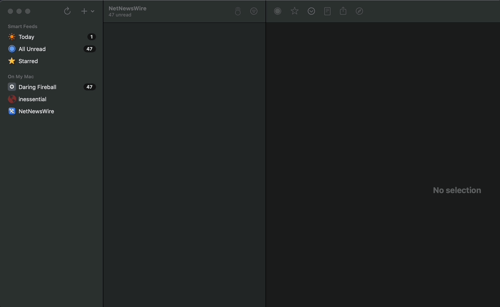

In this article I will show how to add this site's rss feed. In particular,
we will be using [NetNewsWire](https://netnewswire.com) as the rss reader.

## What is an RSS Feed

An RSS feed will show you new posts, generally from a blog, without having
to remember to check the website at regular intervals or signup for an email
list for notifications.

NetNewsWire puts an RSS feed as:

**It's like podcasts** - but for _reading._

You consume an RSS feed, using an RSS reader application or extension in your
browser.

## Step One

First find and download an RSS reader, you can download [NetNewsWire](https://netnewswire.com) for
macOS from the link, or for iOS from the
[AppStore](https://apps.apple.com/us/app/netnewswire-rss-reader/id1480640210).

## Step Two

Add the rss feed to stay up to date when I publish new articles.

1. Click the plus in the right side of the sidebar and select `New Feed...`
1. In the URL field add: `https://mhoush.com/index.xml`
1. Optionally give it a name
1. Click the `Add` button.

That's it.

